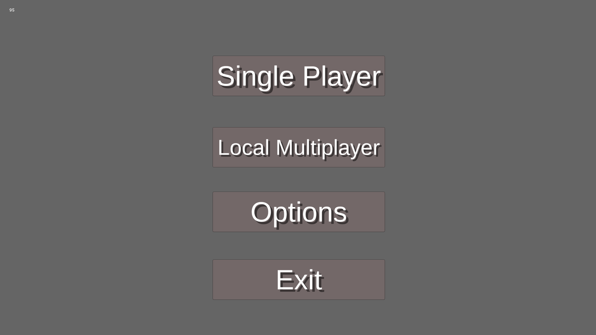

# Ping-Pong Game

## Disclaimer

All assets are my own, except the sounds.

## Table of Contents

- [Introduction](#introduction)
- [Features](#features)
- [Technologies Used](#technologies-used)
- [Usage](#usage)
- [Gameplay](#gameplay)
- [Contributing](#contributing)

## Introduction

Ping-Pong Game is a 2D arcade-style game developed using Unity. Players can engage in fast-paced ping-pong matches against each other or AI opponents. The game features intuitive controls and engaging gameplay, making it suitable for players of all ages.

## Features

- Single-player and multiplayer modes
- AI opponent with adjustable difficulty
- Score tracking for each player
- Simple and intuitive controls
- Responsive design for various screen sizes
- Sound effects and music

### <i>Made With Unity</i>

### Technologies Used

This game is made in Unity Game Engine.

- Unity Version number: 2020.3.25f1
- All Codes are written in C# using Visual Studio Code 2022

## Usage

- Use the arrow keys (or W/S keys) to control the paddle.
- The objective is to hit the ball back to your opponent and score points by making the ball pass their paddle.

## Gameplay

- Start the game from the main menu.
- Choose between single-player or multiplayer mode.
- The game ends when a player reaches the winning score.

### Home Screen



## Single-player (AI Difficulty Selection Screen)

.png>)

## Single-player (Gameplay)

.png>)
.png>)

## Local Multiplayer Screen

- Player 1 will use `W/S` keys on the Keyboard to Control the Paddles
- Player 2 will use `Up Arrow / Down Arrow` keys on the Keyboard to Control the Paddles
  .png>)

## Pause Screen

.png>)

## Contributing

Contributions are welcome! If you have suggestions for improvements or new features, please fork the repository and submit a pull request.

1. Fork the project
2. Create your feature branch:

```bash
    git checkout -b feature/YourFeature
```

3. Commit your changes:

```bash

    git commit -m 'Add some feature'
```

4. Push to the branch:

```bash
    git push origin feature/YourFeature
```

5. Open a pull request.
